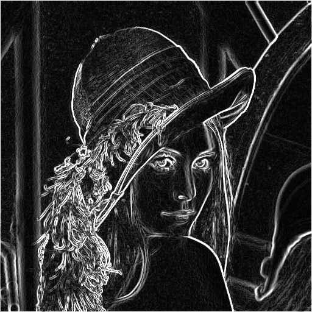

# Filters with CUDA

These are the filters that were implemented with CUDA.

1. [Gaussian Blur](#gaussian-blur)
2. [Sharpen](#sharpen)
3. [Sobel (Edge Detection)](#edge-detection)

# Usage

To use the filters, you need a NVIDIA GPU with CUDA support.

Then run the following command inside `src` folder:

```bash
  # On Windows
  nvcc -o main.cu ./out/main.exe
```

# Gaussian Blur


# Sharpen Filter


# Sobel Filter (Edge Detection)


